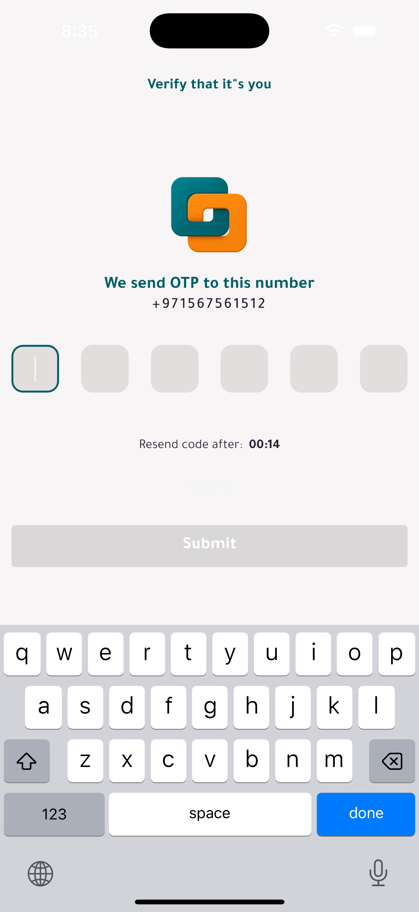
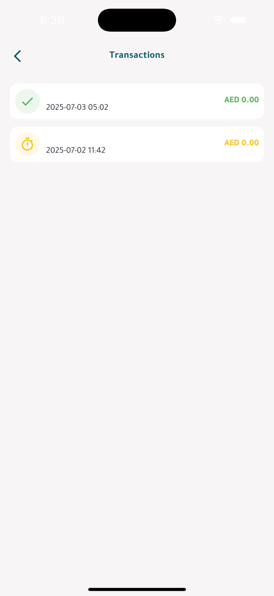

# 🚀 FreelanceZone - Connect & Offer Services with Ease

[](https://flutter.dev/)
[](https://dart.dev/)
[](LICENSE)
[](https://flutter.dev/docs/deployment)

<div align="center">
  
  <h3>Service Marketplace Mobile Application</h3>
</div>

## 📱 Download & Links

<div align="center">

[](https://play.google.com/store/apps/details?id=com.ssgit.freelancezone)
[](https://apps.apple.com/ae/app/freelancezone/id6745444438)
[](https://dohunter.ae/)

</div>

## 📖 Table of Contents

- [About](#-about)
- [Features](#-features)
- [Screenshots](#-screenshots)
- [Tech Stack](#-tech-stack)
- [Architecture](#-architecture)
- [Getting Started](#-getting-started)
- [Project Structure](#-project-structure)
- [API Integration](#-api-integration)
- [State Management](#-state-management)
- [Localization](#-localization)
- [Testing](#-testing)
- [Deployment](#-deployment)
- [Contributing](#-contributing)
- [Support](#-support)
- [License](#-license)

## 🎯 About

**FreelanceZone** is a comprehensive service marketplace mobile application that connects service providers with clients seamlessly. Built with Flutter, the app offers a robust platform for posting service requests, making offers, and managing transactions with advanced features like real-time chat, secure payments, and multi-language support.

### Key Highlights

- 🤝 **Service Marketplace**: Post requests and offer services
- 💬 **Real-time Chat**: Built-in messaging system for negotiations
- 💳 **Secure Payments**: Multiple payment methods with transaction tracking
- 📱 **Cross-Platform**: Available on Android, iOS, and Web
- 🌍 **Multi-Language Support**: Arabic, English, and Urdu localization
- 🔔 **Push Notifications**: Real-time updates and alerts
- 📊 **Analytics & Statistics**: Service performance tracking
- 🎯 **User Types**: Separate interfaces for clients and service providers

## ✨ Features

### Core Features
- **User Authentication & Authorization**
  - Secure login/register system with OTP verification
  - User type selection (Client/Service Provider)
  - Profile management with verification
  - Session management

- **Service Management**
  - Post service requests with detailed descriptions
  - Browse and search services by category
  - Service categorization and filtering
  - Service status tracking

- **Offer System**
  - Send and receive service offers
  - Negotiate prices and terms
  - Accept/reject offers
  - Offer history and tracking

- **Chat & Communication**
  - Real-time messaging between clients and providers
  - File sharing and media support
  - Chat history and notifications
  - Voice messages support

- **Payment & Transactions**
  - Multiple payment methods
  - Secure transaction processing
  - Wallet management
  - Transaction history and receipts

### Advanced Features
- **Multi-language Support**: Arabic (RTL), English (LTR), and Urdu
- **Dark Mode**: Complete dark theme support
- **Location Services**: GPS-based service matching
- **File Management**: Image and document upload
- **Analytics Dashboard**: Service performance metrics
- **Referral System**: Invite friends with tracking
- **Subscription Plans**: Free and Pro subscription options

## 📸 Screenshots

### Onboarding & Authentication
| Onboarding 1 | Onboarding 2 | Onboarding 3 | Login |
|---------------|---------------|---------------|-------|
|  |  |  |  |

### Authentication Flow
| OTP Verification | Interests Selection | User Type Selection | Profile Setup |
|------------------|-------------------|-------------------|---------------|
|  |  |  |  |

### Main App Flow
| Home View 1 | Home View 2 | Categories | Create Service |
|--------------|-------------|------------|----------------|
|  |  |  |  |

### Service Provider Features
| Freelancer Home | Offers Dashboard | Statistics | Reviews |
|-----------------|-----------------|------------|---------|
|  |  |  |  |

### User Interface
| Settings | Dark Mode Settings | Notifications | Languages |
|----------|-------------------|---------------|-----------|
|  |  |  |  |

### Additional Features
| Transactions | Invites Tracking | FAQ | Terms & Conditions |
|--------------|-----------------|-----|-------------------|
|  |  |  |  |

### Subscription Plans
| Free Subscription | Pro Subscription | Invites |
|------------------|------------------|---------|
|  |  |  |

## 🛠️ Tech Stack

### Frontend
- **Framework**: [Flutter](https://flutter.dev/) 3.6.0
- **Language**: [Dart](https://dart.dev/) 3.6.0
- **State Management**: [GetX](https://pub.dev/packages/get) 4.6.6
- **Dependency Injection**: Built-in GetX DI

### Backend Integration
- **HTTP Client**: [Dio](https://pub.dev/packages/dio) 5.8.0+1
- **JSON Serialization**: Built-in Dart JSON
- **API Documentation**: RESTful APIs with comprehensive documentation

### UI/UX
- **Icons**: [Bootstrap Icons](https://pub.dev/packages/bootstrap_icons) 1.11.3
- **Images**: [Cached Network Image](https://pub.dev/packages/cached_network_image) 3.4.1
- **Animations**: [Lottie](https://pub.dev/packages/lottie) 3.3.1
- **Carousel**: [Carousel Slider](https://pub.dev/packages/carousel_slider) 5.0.0

### Localization & Internationalization
- **Localization**: Custom implementation with JSON files
- **Date/Time**: [Jiffy](https://pub.dev/packages/jiffy) 6.3.2
- **Supported Languages**: Arabic (RTL), English (LTR), Urdu

### Firebase Integration
- **Core**: [Firebase Core](https://pub.dev/packages/firebase_core) 3.15.0
- **Messaging**: [Firebase Messaging](https://pub.dev/packages/firebase_messaging) 15.2.8
- **Analytics**: [Firebase Analytics](https://pub.dev/packages/firebase_analytics) 11.5.1

### Utilities
- **Connectivity**: [Connectivity Plus](https://pub.dev/packages/connectivity_plus) 6.1.3
- **Notifications**: [Flutter Local Notifications](https://pub.dev/packages/flutter_local_notifications) 19.0.0
- **Permissions**: [Permission Handler](https://pub.dev/packages/permission_handler) 11.3.1
- **URL Launcher**: [URL Launcher](https://pub.dev/packages/url_launcher) 6.3.1
- **File Picker**: [File Picker](https://pub.dev/packages/file_picker) 8.1.7
- **Image Picker**: [Image Picker](https://pub.dev/packages/image_picker) 1.1.2

### Maps & Location
- **Google Maps**: [Google Maps Flutter](https://pub.dev/packages/google_maps_flutter) 2.1.5
- **Geolocation**: [Geolocator](https://pub.dev/packages/geolocator) 13.0.1
- **Place Picker**: [Place Picker Google](https://pub.dev/packages/place_picker_google) 0.0.14

### Additional Features
- **QR Code**: [QR Flutter](https://pub.dev/packages/qr_flutter) 4.1.0
- **Markdown**: [Markdown Widget](https://pub.dev/packages/markdown_widget) 2.3.2+8
- **Sharing**: [Share Plus](https://pub.dev/packages/share_plus) 11.0.0
- **Speech to Text**: [Speech to Text](https://pub.dev/packages/speech_to_text) 7.0.0
- **Charts**: [Syncfusion Flutter Charts](https://pub.dev/packages/syncfusion_flutter_charts) 28.2.7

## 🏗️ Architecture

The app follows a feature-based architecture with GetX state management:

```
lib/
├── config/              # App configuration
│   ├── api/            # API configuration
│   ├── assets/         # Asset management
│   ├── const/          # Constants and enums
│   ├── date/           # Date utilities
│   ├── lang/           # Localization
│   ├── local/          # Local storage
│   ├── media/          # Media handling
│   ├── setting/        # App settings
│   ├── styles/         # Styling
│   ├── theme/          # Theme management
│   └── validator/      # Validation utilities
├── views/              # UI screens
│   ├── add_services/   # Service creation
│   ├── analysis/       # Analytics
│   ├── auth/           # Authentication
│   ├── bookmark/       # Bookmarks
│   ├── category/       # Categories
│   ├── chat/           # Messaging
│   ├── core/           # Core screens
│   ├── home/           # Home screens
│   ├── main/           # Main navigation
│   ├── my_services/    # Service management
│   ├── notifications/  # Notifications
│   ├── offers/         # Offers system
│   ├── payment/        # Payment processing
│   ├── posts/          # Posts/Requests
│   ├── profile/        # User profiles
│   ├── review/         # Reviews
│   ├── search/         # Search functionality
│   ├── splash/         # Splash screens
│   ├── user_type/      # User type selection
│   └── wallet/         # Wallet management
└── widget/             # Reusable widgets
```

### Design Patterns
- **GetX Pattern**: For state management and dependency injection
- **Repository Pattern**: For data access
- **Feature-based Architecture**: Organized by features
- **Clean Architecture**: For maintainability

## 🚀 Getting Started

### Prerequisites
- [Flutter](https://flutter.dev/docs/get-started/install) 3.6.0 or higher
- [Dart](https://dart.dev/get-dart) 3.6.0 or higher
- [Android Studio](https://developer.android.com/studio) or [VS Code](https://code.visualstudio.com/)
- [Git](https://git-scm.com/)

### Installation

1. **Clone the repository**
   ```bash
   git clone https://github.com/Mohammad-al-rifai/freelancezone.git
   cd freelancezone
   ```

2. **Install dependencies**
   ```bash
   flutter pub get
   ```

3. **Configure environment variables**
   ```bash
   # Copy .env.example to .env and fill in your values
   cp .env.example .env
   ```

4. **Run the app**
   ```bash
   flutter run
   ```

## 📁 Project Structure

```
freelancezone/
├── android/              # Android-specific files
├── ios/                  # iOS-specific files
├── lib/                  # Main Dart code
│   ├── config/          # App configuration
│   ├── views/           # UI screens
│   ├── widget/          # Reusable widgets
│   └── main.dart        # App entry point
├── assets/              # Static assets
│   ├── fonts/           # Custom fonts (Tajawal)
│   ├── images/          # Images and icons
│   ├── languages/       # Localization files
│   └── screenshots/     # App screenshots
├── test/                # Test files
└── pubspec.yaml         # Dependencies
```

## 🔌 API Integration

The app integrates with a RESTful API for:
- User authentication and management
- Service posting and management
- Offer system and negotiations
- Payment processing and transactions
- Chat and messaging services
- Notification services

### API Features
- **Authentication**: JWT token-based authentication
- **Caching**: Intelligent caching for offline support
- **Error Handling**: Comprehensive error handling and retry logic
- **Rate Limiting**: Proper rate limiting implementation
- **Security**: HTTPS with certificate pinning

## 📊 State Management

The app uses **GetX** for state management:

- **GetX Controller**: Manages state and business logic
- **GetX Service**: Handles dependency injection
- **GetX Route**: Manages navigation
- **GetX Storage**: Handles local storage

### Key Controllers
- **AuthController**: Manages authentication state
- **HomeController**: Handles home screen data
- **ChatController**: Manages messaging
- **PaymentController**: Handles payment processing
- **NotificationController**: Manages notifications

## 🌍 Localization

The app supports multiple languages with RTL support:

### Supported Languages
- **Arabic** (RTL) - Primary language
- **English** (LTR) - Secondary language
- **Urdu** (RTL) - Additional language

### Adding New Languages
1. Add translation file in `assets/languages/`
2. Update language controller
3. Test RTL/LTR layouts

## 🧪 Testing

### Test Structure
```
test/
├── unit/           # Unit tests
├── widget/         # Widget tests
└── integration/    # Integration tests
```

## 🤝 Contributing

We welcome contributions! Please follow these steps:

### Contribution Guidelines
- Follow the existing code style
- Add tests for new features
- Update documentation as needed
- Ensure all tests pass

## 📞 Support

### Contact Information
- **Developer**: ENG. MOHAMMAD ALREFAIE
- **Email**: eng.mohammad.uae@gmail.com
- **UAE Phone**: +971567561512
- **Syria Phone**: +963996696170
- **Address**: UAE - Dubai

### Links
- 🌐 **Website**: [https://dohunter.ae/](https://dohunter.ae/)
- 📱 **Google Play**: [https://play.google.com/store/apps/details?id=com.ssgit.freelancezone](https://play.google.com/store/apps/details?id=com.ssgit.freelancezone)
- 🍎 **App Store**: [https://apps.apple.com/ae/app/freelancezone/id6745444438](https://apps.apple.com/ae/app/freelancezone/id6745444438)

### Developer Profiles
- 💼 **LinkedIn**: [https://www.linkedin.com/in/muhammad-al-rifai/](https://www.linkedin.com/in/muhammad-al-rifai/)
- 🐙 **GitHub**: [https://github.com/Mohammad-al-rifai](https://github.com/Mohammad-al-rifai)

### Getting Help
- 📧 **Email Support**: eng.mohammad.uae@gmail.com
- 📱 **UAE Phone Support**: +971567561512
- 📱 **Syria Phone Support**: +963996696170
- 🐛 **Report Issues**: Create an issue on GitHub

## 📄 License

This project is licensed under the MIT License - see the [LICENSE](LICENSE) file for details.

## 🙏 Acknowledgments

- Flutter team for the amazing framework
- All contributors and beta testers
- The open-source community for various packages used
- Smart Science Gate Information Technology for support

---

<div align="center">
  <p>Made with ❤️ by <a href="https://dohunter.ae/">FreelanceZone Team</a></p>
  <p>⭐ Star this repository if you find it helpful!</p>
</div>
